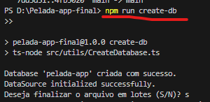
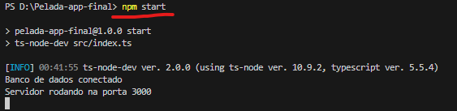
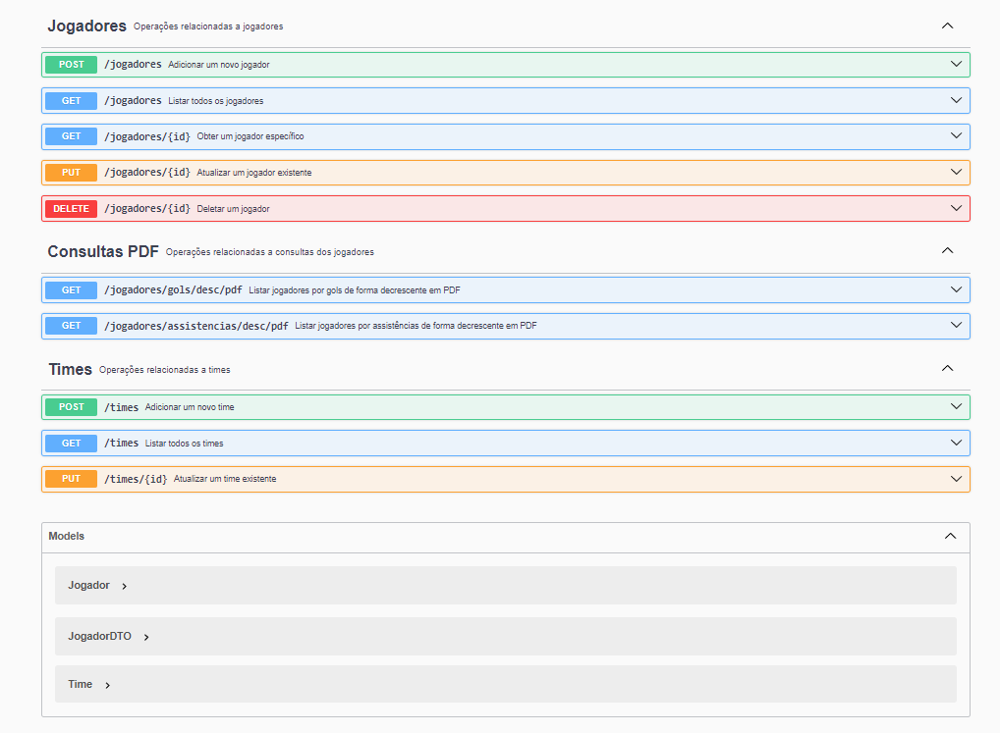
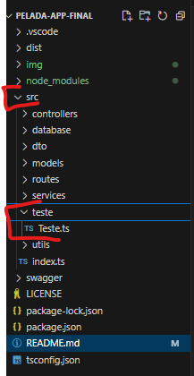
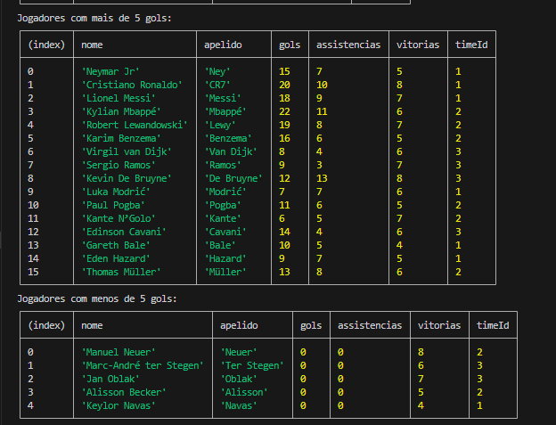

# Pelada App

**Pelada App** é uma aplicação desenvolvida para gerenciar jogadores de futebol. Com funcionalidades completas de CRUD, geração de relatórios em PDF, e integração com Swagger para documentação interativa da API, o Pelada App é uma solução robusta para a gestão de equipes e jogadores. A aplicação é construída com TypeScript, Node.js, Express, e TypeORM, proporcionando uma arquitetura escalável e de fácil manutenção.

## Tecnologias Utilizadas

- **TypeScript**: Superconjunto do JavaScript que adiciona tipagem estática ao código.
- **Node.js**: Ambiente de execução para JavaScript, permitindo o desenvolvimento de aplicações server-side.
- **Express**: Framework minimalista para Node.js, utilizado para criar a API.
- **TypeORM**: ORM para TypeScript e JavaScript, facilitando a manipulação de bancos de dados relacionais.
- **MySQL**: Sistema de gerenciamento de banco de dados relacional utilizado para armazenamento de dados.
- **Swagger**: Ferramenta para geração de documentação interativa de APIs RESTful.
- **swagger-ui-express**: Middleware para integrar o Swagger com o Express.
- **PDFKit**: Biblioteca para geração de documentos PDF diretamente do código.
- **CORS**: Middleware para habilitar o compartilhamento de recursos entre diferentes origens, essencial para APIs RESTful.

## Funcionalidades Principais

### Jogadores

- **Adicionar Jogador**: `POST /jogadores`
- **Listar Jogadores**: `GET /jogadores`
- **Obter Jogador por ID**: `GET /jogadores/{id}`
- **Deletar Jogador**: `DELETE /jogadores/{id}`
- **Ranking de Jogadores**: `GET /jogadores/ranking`
- **Listar Jogadores por Gols (PDF)**: `GET /jogadores/gols/desc/pdf`
- **Listar Jogadores por Assistências (PDF)**: `GET /jogadores/assistencias/desc/pdf`

### Times

- **Adicionar Time**: `POST /times`
- **Listar Times**: `GET /times`

## Configuração e Execução

### Pré-requisitos

- **Node.js** e **npm** instalados.
- **MySQL** ativo e configurado.


# Execução do programa

## Exemplo a ser descrito 


- Após criar, aperta Ctrl + C e digite "s"

- Depois siga para o start para testar o Swagger




### Caso queira testar o banco da uma olhada la embaixo em: Teste para alimentar o banco (TESTE)

0. **Compile o projeto TypeScript**:
```bash
    tsc
```
1. **Criando o Banco**
```bash
    npm run create-db 
```
2. **Execute o start para utilizar o swagger**:
```bash
    npm start
```
# Para utilizar o servidor e utilizar o Swagger
## Swagger

- **Para acessar a documentação interativa da API, abra o navegador e vá para a seguinte URL**: http://localhost:3000/api-docs

### Exemplo a ser descrito


- OBS: com o model embaixo da requisição de endpoit da para ter uma idea melhor no output e input

## Rotas da API

#### Adicionar um Novo Jogador

- **Método:** `POST`
- **Endpoint:** `/jogadores`
- **Descrição:** Adiciona um novo jogador à base de dados.
- **Parâmetros:**
  - **Corpo da Requisição (JSON):**
    ```json
    {
      "nome": "Lionel Messi",
      "apelido": "Messi",
      "gols": 25,
      "assistencias": 10,
      "vitorias": 5,
      "time": {
        "id": 1,
        "nome": "Barcelona"
      }
    }
    ```
- **Resposta:**
  - **Código 200:** Jogador adicionado com sucesso.
  - **Corpo da Resposta (JSON):**
    ```json
    {
      "id": 1,
      "nome": "Lionel Messi",
      "apelido": "Messi",
      "gols": 25,
      "assistencias": 10,
      "vitorias": 5,
      "time": {
        "id": 1,
        "nome": "Barcelona"
      }
    }
    ```

#### Listar Todos os Jogadores

- **Método:** `GET`
- **Endpoint:** `/jogadores`
- **Descrição:** Lista todos os jogadores.
- **Resposta:**
  - **Código 200:** Lista de jogadores.
  - **Corpo da Resposta (JSON):**
    ```json
    [
      {
        "id": 1,
        "apelido": "Messi",
        "gols": 25,
        "assistencias": 10
      },
      ...
    ]
    ```

#### Obter um Jogador Específico

- **Método:** `GET`
- **Endpoint:** `/jogadores/{id}`
- **Descrição:** Obtém os detalhes de um jogador específico.
- **Parâmetros:**
  - **Path:**
    - `id` (integer): ID do jogador.
- **Resposta:**
  - **Código 200:** Detalhes do jogador.
  - **Código 404:** Jogador não encontrado.
  - **Corpo da Resposta (JSON):**
    ```json
    {
      "id": 1,
      "nome": "Lionel Messi",
      "apelido": "Messi",
      "gols": 25,
      "assistencias": 10,
      "vitorias": 5,
      "time": {
        "id": 1,
        "nome": "Barcelona"
      }
    }
    ```

#### Deletar um Jogador

- **Método:** `DELETE`
- **Endpoint:** `/jogadores/{id}`
- **Descrição:** Deleta um jogador específico.
- **Parâmetros:**
  - **Path:**
    - `id` (integer): ID do jogador.
- **Resposta:**
  - **Código 204:** Jogador deletado com sucesso.

#### Obter Ranking dos Jogadores

- **Método:** `GET`
- **Endpoint:** `/jogadores/ranking`
- **Descrição:** Obtém o ranking dos jogadores com base em suas estatísticas.
- **Resposta:**
  - **Código 200:** Ranking dos jogadores.
  - **Corpo da Resposta (JSON):**
    ```json
    [
      {
        "id": 1,
        "apelido": "Messi",
        "gols": 25,
        "assistencias": 10
      },
      ...
    ]
    ```

#### Listar Jogadores por Gols Decrescentes em PDF

- **Método:** `GET`
- **Endpoint:** `/jogadores/gols/desc/pdf`
- **Descrição:** Gera um PDF com a lista de jogadores ordenada por gols de forma decrescente.
- **Resposta:**
  - **Código 200:** PDF gerado com sucesso.
  - **Corpo da Resposta:** Arquivo PDF.

#### Listar Jogadores por Assistências Decrescentes em PDF

- **Método:** `GET`
- **Endpoint:** `/jogadores/assistencias/desc/pdf`
- **Descrição:** Gera um PDF com a lista de jogadores ordenada por assistências de forma decrescente.
- **Resposta:**
  - **Código 200:** PDF gerado com sucesso.
  - **Corpo da Resposta:** Arquivo PDF.

### Times

#### Adicionar um Novo Time

- **Método:** `POST`
- **Endpoint:** `/times`
- **Descrição:** Adiciona um novo time à base de dados.
- **Parâmetros:**
  - **Corpo da Requisição (JSON):**
    ```json
    {
      "nome": "Barcelona",
      "jogadores": [
        {
          "id": 1,
          "nome": "Lionel Messi"
        }
      ]
    }
    ```
- **Resposta:**
  - **Código 200:** Time adicionado com sucesso.
  - **Corpo da Resposta (JSON):**
    ```json
    {
      "id": 1,
      "nome": "Barcelona",
      "jogadores": [
        {
          "id": 1,
          "nome": "Lionel Messi"
        }
      ]
    }
    ```

#### Listar Todos os Times

- **Método:** `GET`
- **Endpoint:** `/times`
- **Descrição:** Lista todos os times.
- **Resposta:**
  - **Código 200:** Lista de times.
  - **Corpo da Resposta (JSON):**
    ```json
    [
      {
        "id": 1,
        "nome": "Barcelona",
        "jogadores": [
          {
            "id": 1,
            "nome": "Lionel Messi"
          }
        ]
      },
      ...
    ]
    ```


# Teste para alimentar o banco (TESTE)

## Exemplo a ser descrito



src/teste/Teste.ts
## Exemplo ao executar o script



### Este script irá:
- Cria 3 times e 20 jogadores com dados fictícios.
- Executar uma série de consultas SQL para filtrar e exibir informações sobre os jogadores e os times.
- Imprimir os resultados no console para análise.

### As consultas incluídas são:
- Jogadores que estão no mesmo time.
- Jogadores com mais de 5 gols e menos de 5 gols.
- Jogadores ordenados por assistências (crescente e decrescente).
- Jogadores com mais gols e assistências.
- Jogadores de um time específico.
- Jogadores com o maior e menor número de vitórias.
- Jogadores com mais assistências e menos vitórias.


## São essas as consultas SQL

Aqui estão algumas consultas SQL úteis para consultar e analisar dados dos jogadores e times no banco de dados.

### 1. Jogadores que estão no mesmo time
```sql
SELECT j1.nome AS jogador1, j2.nome AS jogador2, t.nome AS time
FROM Jogador j1
JOIN Jogador j2 ON j1.timeId = j2.timeId
JOIN Time t ON j1.timeId = t.id
WHERE j1.id < j2.id;
```
### 2. Jogadores com mais de 5 gols
```sql
Copiar código
SELECT nome, apelido, gols, assistencias, vitorias, timeId
FROM Jogador
WHERE gols > 5;
```
### 3. Jogadores com menos de 5 gols
```sql
Copiar código
SELECT nome, apelido, gols, assistencias, vitorias, timeId
FROM Jogador
WHERE gols < 5;
```
### 4. Jogadores ordenados por assistências em ordem decrescente
```sql
Copiar código
SELECT nome, apelido, assistencias
FROM Jogador
ORDER BY assistencias DESC;
```
### 5. Jogadores ordenados por assistências em ordem crescente
```sql
Copiar código
SELECT nome, apelido, assistencias
FROM Jogador
ORDER BY assistencias ASC;
```
### 6. Jogadores com mais gols e mais assistências
```sql
Copiar código
SELECT nome, apelido, gols, assistencias
FROM Jogador
ORDER BY gols DESC, assistencias DESC;
### 7. Jogadores de um time específico
Substitua 'Time A' pelo nome do time desejado:
```
```sql
Copiar código
SELECT j.nome, j.apelido, j.gols, j.assistencias
FROM Jogador j
JOIN Time t ON j.timeId = t.id
WHERE t.nome = 'Time A';
```
### 8. Jogadores com o maior número de vitórias
```sql
Copiar código
SELECT nome, apelido, vitorias
FROM Jogador
ORDER BY vitorias DESC;
```
### 9. Jogadores com o menor número de vitórias
```sql
Copiar código
SELECT nome, apelido, vitorias
FROM Jogador
ORDER BY vitorias ASC;
```
### 10. Jogadores com mais assistências e menos vitórias
```sql
Copiar código
SELECT nome, apelido, assistencias, vitorias
FROM Jogador
ORDER BY assistencias DESC, vitorias ASC;
```
