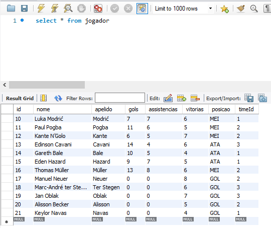

# Pelada App


**Pelada App** é uma aplicação desenvolvida para gerenciar jogadores de futebol. Com funcionalidades completas de CRUD, geração de relatórios em PDF, e integração com Swagger para documentação interativa da API, 

A aplicação é construída com TypeScript, Node.js, Express, e TypeORM, proporcionando uma arquitetura escalável e de fácil manutenção.

## Tecnologias Utilizadas

- **TypeScript**: Superconjunto do JavaScript que adiciona tipagem estática ao código.
- **Node.js**: Ambiente de execução para JavaScript, permitindo o desenvolvimento de aplicações server-side.
- **Express**: Framework minimalista para Node.js, utilizado para criar a API.
- **TypeORM**: ORM para TypeScript e JavaScript, facilitando a manipulação de bancos de dados relacionais.
- **MySQL**: Sistema de gerenciamento de banco de dados relacional utilizado para armazenamento de dados.
- **Swagger**: Ferramenta para geração de documentação interativa de APIs RESTful.
- **swagger-ui-express**: Middleware para integrar o Swagger com o Express.
- **PDFKit**: Biblioteca para geração de documentos PDF diretamente do código.
- **CORS**: Middleware para habilitar o compartilhamento de recursos entre diferentes origens, essencial para APIs RESTful.

### Principal funcionalidade


### Ajustes e melhorias

O projeto ainda está em desenvolvimento e as próximas atualizações serão voltadas para as seguintes tarefas:

- [x] Front-End 


## 💻 Pré-requisitos

- **Node.js** e **npm** instalados.
- **MySQL** ativo e configurado.

## 📫 Contribuindo para PeladaApp

Para contribuir com <PeladaApp>, siga estas etapas:

1. Bifurque este repositório.
2. Crie um branch: `git checkout -b <nome_branch>`.
3. Faça suas alterações e confirme-as: `git commit -m '<mensagem_commit>'`
4. Envie para o branch original: `git push origin <nome_do_projeto> / <local>`
5. Crie a solicitação de pull.

Como alternativa, consulte a documentação do GitHub em [como criar uma solicitação pull](https://help.github.com/en/github/collaborating-with-issues-and-pull-requests/creating-a-pull-request).

## 🤝 Colaboradores

<table>
  <tr>
    <td align="center">
      <a href="#" title="Lenda">
        <br>
        <sub>
          <b>Lucas C Alecrim</b>
        </sub>
      </a>
    </td>
</table>

## 😄 Seja um dos contribuidores

Quer fazer parte desse projeto? Clique [AQUI](CONTRIBUTING.md) e leia como contribuir.

## 📝 Licença

O Pelada App está licenciado sob a Licença MIT. Veja o arquivo [LICENSE](LICENSE) para mais detalhes.

## Funcionalidades Principais

### Jogadores

- **Adicionar Jogador**: `POST /jogadores`
- **Listar Jogadores**: `GET /jogadores`
- **Obter Jogador por ID**: `GET /jogadores/{id}`
- **Atualizar Jogador**: `PUT /jogadores/{id}`
- **Deletar Jogador**: `DELETE /jogadores/{id}`

### Consultas PDF

- **Listar Jogadores por Gols (PDF)**: `GET /jogadores/gols/desc/pdf`
- **Listar Jogadores por Assistências (PDF)**: `GET /jogadores/assistencias/desc/pdf`

### Times

- **Adicionar Time**: `POST /times`
- **Listar Times**: `GET /times`
- **Atualizar Jogador**: `PUT /times/{id}`

**Configuração correta do banco**
- no meu caso optei por mysql no workbanch

```typescript
import { DataSource } from 'typeorm';
import { Jogador } from '../models/Jogador';
import { Time } from '../models/Time';

export const AppDataSource = new DataSource({
    type: 'mysql',
    host: 'localhost',
    port: 3306,
    username: 'root', // usuario
    password: 'root', // senha do banco
    database: 'pelada-app', // tabela a ser criada
    entities: [Jogador, Time],
    synchronize: true,  
});
```
**Script para a criação do banco automaticamente**
```typescript
import mysql from 'mysql2/promise';
import { AppDataSource } from '../database/DataSource';

async function createDatabaseIfNotExists() {
  const connection = await mysql.createConnection({
    host: 'localhost',
    user: 'root',
    password: 'root',
  });

  const databaseName = process.env.DB_NAME || 'pelada-app';

  try {
    const [rows] = await connection.query('SHOW DATABASES LIKE ?', [databaseName]) as [mysql.RowDataPacket[], mysql.FieldPacket[]];
    
    if (rows.length === 0) {
      await connection.query('CREATE DATABASE ??', [databaseName]);
      console.log(`Database '${databaseName}' criada com sucesso.`);
    } else {
      console.log(`Database '${databaseName}' ja existe.`);
    }
  } catch (error) {
    console.error('Erro criando a database:', error);
} finally {
    await connection.end();
  }
}

async function initializeDataSource() {
  await AppDataSource.initialize();
  console.log('DataSource initialized successfully.');
}

async function setup() {
  await createDatabaseIfNotExists();
  await initializeDataSource();
}
setup().catch(error => console.error('Setup failed:', error));
```
- O script ele vai ser executado da seguite maneira

**Compile o projeto TypeScript**:

```bash
    tsc 
```
- feito isso (So para ter certeza que vai copilar todo o ts) pois vamos fazer uns "testes"
- Você vai criar o banco automaticamente com esse comando a seguir

- Exemplo a ser descrito:


```bash    
    npm run create-db 
```
- Após criar, aperta Ctrl + C e digite "s"
- Feito isso vamos a fase de alimentação do banco e buscas com teste
- Basicamente, você depois de criar o banco voce vai inserir as informações das tabelas com o script TesteAddJogadores.ts
- lembrando que vamos puxar esse script do dist, por isso usamos o "tsc"

- A seguir como utilizar o teste e alimentar o Banco 

```bash 
node .\dist\teste\TesteAddJogadores.js
```
 - para verificar se deu certo vá no banco e coloque a seguinte query 

 ```sql
 select * from jogador
 ```
- se for alimentada como na imagem a seguir deu certo!



### **Existe uma opção de teste após essa**

- essa opção inclui em gerar Querys (Buscas) automaticas da mesma maneira que alimentamos o banco, podendo ser usada como base para outras buscas
```bash 
node .\dist\teste\TesteConsultas.js
```
---------------------------------------------------------------------------
# SWAGGER E SEUS ENDPOINTS 

## Iniciando o Servidor para o Swagger

1. **Clone o repositório**:
    ```bash
    git clone https://github.com/LucasCAlecrim/Pelada-app-final.git
    ```

2. **Instale as dependências**:
    ```bash
    npm install
    ```

3. **Compile o projeto**:
    ```bash
    npm run build
    ```

4. **Inicie o servidor**:
    ```bash
    npm start
    ```

5. **Acesse a API**:
    - Base URL: `http://localhost:3000/api`
    - Documentação Swagger disponível em: `http://localhost:3000/api-docs`

## Funcionalidades e iniciando todo o processo de CRUD


A API está organizada em três principais grupos de operações:

1. **Jogadores**: Operações relacionadas ao gerenciamento de jogadores.
2. **Consultas PDF**: Operações para gerar relatórios em PDF com base em estatísticas dos jogadores.
3. **Times**: Operações relacionadas ao gerenciamento de times.

#### `POST /jogadores`

- **Descrição**: Adiciona um novo jogador.
- **Corpo da Requisição**: JSON contendo os dados do jogador.
- **Resposta**: Retorna o jogador criado.

#### `GET /jogadores`

- **Descrição**: Lista todos os jogadores cadastrados.
- **Resposta**: Retorna um array de jogadores.

#### `GET /jogadores/{id}`

- **Descrição**: Retorna os detalhes de um jogador específico com base no ID.
- **Parâmetros**: 
  - `id` (path): ID do jogador.
- **Resposta**: Retorna os detalhes do jogador ou uma mensagem de erro caso não seja encontrado.

#### `PUT /jogadores/{id}`

- **Descrição**: Atualiza os dados de um jogador existente.
- **Parâmetros**: 
  - `id` (path): ID do jogador.
- **Corpo da Requisição**: JSON contendo os dados atualizados do jogador.
- **Resposta**: Retorna o jogador atualizado ou uma mensagem de erro caso não seja encontrado.

#### `DELETE /jogadores/{id}`

- **Descrição**: Deleta um jogador com base no ID.
- **Parâmetros**: 
  - `id` (path): ID do jogador.
- **Resposta**: Retorna uma resposta de sucesso ou uma mensagem de erro caso não seja encontrado.

### Consultas PDF

#### `GET /jogadores/gols/desc/pdf`

- **Descrição**: Gera um relatório em PDF listando os jogadores ordenados por número de gols em ordem decrescente.
- **Resposta**: Retorna um PDF gerado com sucesso.

#### `GET /jogadores/assistencias/desc/pdf`

- **Descrição**: Gera um relatório em PDF listando os jogadores ordenados por número de assistências em ordem decrescente.
- **Resposta**: Retorna um PDF gerado com sucesso.

### Times

#### `POST /times`

- **Descrição**: Adiciona um novo time.
- **Corpo da Requisição**: JSON contendo os dados do time.
- **Resposta**: Retorna o time criado.

#### `GET /times`

- **Descrição**: Lista todos os times cadastrados.
- **Resposta**: Retorna um array de times.

## Conclusão

O Pelada App oferece uma solução completa para a gestão de jogadores e times de futebol, com funcionalidades robustas e uma documentação clara através do Swagger. A utilização de tecnologias modernas garante uma aplicação escalável e fácil de manter. 

---

**Repositório GitHub**: [Pelada App](https://github.com/LucasCAlecrim/Pelada-app-final)


