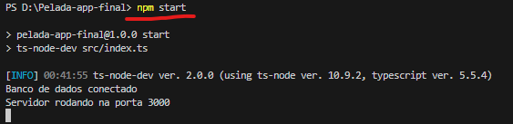
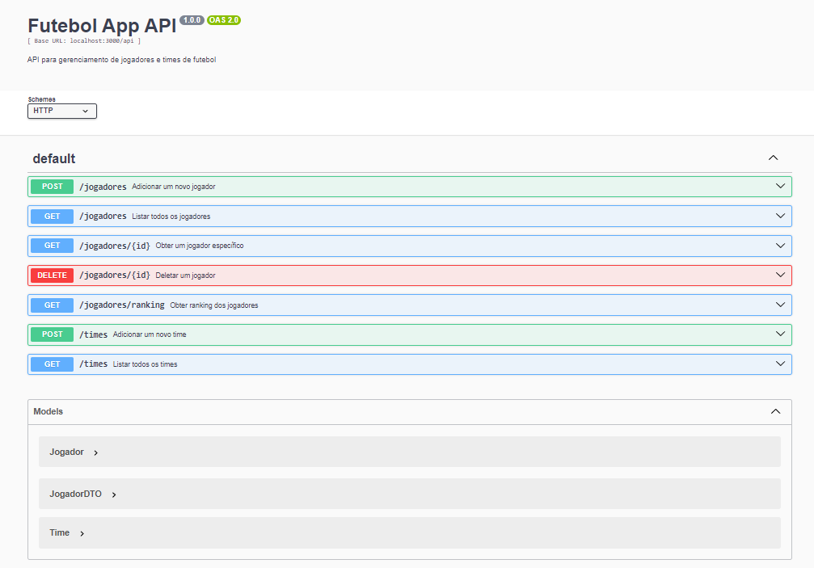
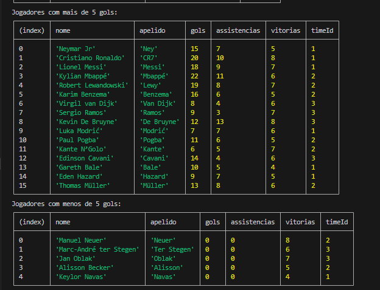

# Pelada App

Este é um aplicativo de gerenciamento de jogadores de futebol, desenvolvido em TypeScript com Node.js, Express e TypeORM. O projeto inclui um CRUD completo para jogadores, com funcionalidade para gerar relatórios e adicionar jogadores a times.

# Guia de Utilização do Projeto

Este guia fornece instruções sobre como configurar e utilizar o projeto de aplicação de futebol, incluindo detalhes sobre as tecnologias usadas e as rotas disponíveis na API.

## Tecnologias Usadas

- **TypeScript**: Superconjunto do JavaScript com tipagem estática.
- **TypeORM**: ORM para TypeScript e JavaScript que facilita a manipulação de bancos de dados relacionais.
- **Express**: Framework para Node.js que facilita a criação de APIs e servidores.
- **MySQL**: Sistema de gerenciamento de banco de dados relacional usado para armazenar dados.
- **Swagger**: Ferramenta para gerar documentação interativa para APIs RESTful.
- **swagger-ui-express**: Middleware para integrar o Swagger com o Express.

# Execução do programa

## Exemplo a ser descrito 


- Após criar, aperta Ctrl + C e digite "s"

- Depois siga para o start para testar o Swagger




### Caso queira testar o banco da uma olhada la embaixo em: Teste para alimentar o banco (TESTE)

0. **Compile o projeto TypeScript**:
```bash
    tsc
```
1. **Criando o Banco**
```bash
    npm run create-db 
```
2. **Execute o start para utilizar o swagger**:
```bash
    npm start
```
# Para utilizar o servidor e utilizar o Swagger
## Swagger

- **Para acessar a documentação interativa da API, abra o navegador e vá para a seguinte URL**: http://localhost:3000/api-docs

### Exemplo a ser descrito


- OBS: com o model embaixo da requisição de endpoit da para ter uma idea melhor no output e input

## Rotas da API

### 1. Rotas de Jogadores

- **Criar Jogador**
  - **Método**: `POST`
  - **Endpoint**: `/jogadores`
  - **Descrição**: Cria um novo jogador.
  - **Exemplo de Corpo da Requisição**:
    ```json
    {
      "nome": "Nome do Jogador",
      "apelido": "Apelido",
      "gols": 10,
      "assistencias": 5,
      "vitórias": 7
    }
    ```

- **Listar Todos os Jogadores**
  - **Método**: `GET`
  - **Endpoint**: `/jogadores`
  - **Descrição**: Retorna uma lista de todos os jogadores.

- **Buscar Jogador por ID**
  - **Método**: `GET`
  - **Endpoint**: `/jogadores/:id`
  - **Descrição**: Retorna um jogador específico pelo ID.

- **Deletar Jogador por ID**
  - **Método**: `DELETE`
  - **Endpoint**: `/jogadores/:id`
  - **Descrição**: Deleta um jogador específico pelo ID.

- **Obter Ranking dos Jogadores**
  - **Método**: `GET`
  - **Endpoint**: `/jogadores/ranking`
  - **Descrição**: Retorna uma lista de jogadores ordenada por número de gols e, em caso de empate, por assistências.

### 2. Rotas de Times

- **Criar Time**
  - **Método**: `POST`
  - **Endpoint**: `/times`
  - **Descrição**: Cria um novo time.
  - **Exemplo de Corpo da Requisição**:
    ```json
    {
      "nome": "Nome do Time"
    }
    ```

- **Listar Todos os Times**
  - **Método**: `GET`
  - **Endpoint**: `/times`
  - **Descrição**: Retorna uma lista de todos os times.


### Rotas no Swagger

#### Jogadores

- **POST /jogadores**
  - Cria um novo jogador. Requer um corpo da requisição com os campos `nome`, `apelido`, `gols`, `assistencias`, e `vitórias`.

- **GET /jogadores**
  - Lista todos os jogadores.

- **GET /jogadores/:id**
  - Retorna as informações de um jogador específico pelo ID.

- **DELETE /jogadores/:id**
  - Remove um jogador específico pelo ID.

- **GET /jogadores/ranking**
  - Retorna a classificação dos jogadores baseada em gols e assistências.

#### Times

- **POST /times**
  - Cria um novo time. Requer um corpo da requisição com o campo `nome`.

- **GET /times**
  - Lista todos os times.

## Exemplos de Respostas

### Jogadores

- **GET /jogadores**
  - **Resposta**:
    ```json
    [
      {
        "id": 1,
        "nome": "Nome do Jogador",
        "apelido": "Apelido",
        "gols": 10,
        "assistencias": 5,
        "vitórias": 7
      }
    ]
    ```

- **GET /jogadores/:id**
  - **Resposta**:
    ```json
    {
      "id": 1,
      "nome": "Nome do Jogador",
      "apelido": "Apelido",
      "gols": 10,
      "assistencias": 5,
      "vitórias": 7
    }
    ```

### Times

- **GET /times**
  - **Resposta**:
    ```json
    [
      {
        "id": 1,
        "nome": "Nome do Time"
      }
    ]
    ```


# Teste para alimentar o banco (TESTE)

## Exemplo a ser descrito


src/teste/Teste.ts
## Exemplo ao executar o script



### Este script irá:
- Cria 3 times e 20 jogadores com dados fictícios.
- Executar uma série de consultas SQL para filtrar e exibir informações sobre os jogadores e os times.
- Imprimir os resultados no console para análise.

### As consultas incluídas são:
- Jogadores que estão no mesmo time.
- Jogadores com mais de 5 gols e menos de 5 gols.
- Jogadores ordenados por assistências (crescente e decrescente).
- Jogadores com mais gols e assistências.
- Jogadores de um time específico.
- Jogadores com o maior e menor número de vitórias.
- Jogadores com mais assistências e menos vitórias.


## São essas as consultas SQL

Aqui estão algumas consultas SQL úteis para consultar e analisar dados dos jogadores e times no banco de dados.

### 1. Jogadores que estão no mesmo time
```sql
SELECT j1.nome AS jogador1, j2.nome AS jogador2, t.nome AS time
FROM Jogador j1
JOIN Jogador j2 ON j1.timeId = j2.timeId
JOIN Time t ON j1.timeId = t.id
WHERE j1.id < j2.id;
```
### 2. Jogadores com mais de 5 gols
```sql
Copiar código
SELECT nome, apelido, gols, assistencias, vitorias, timeId
FROM Jogador
WHERE gols > 5;
```
### 3. Jogadores com menos de 5 gols
```sql
Copiar código
SELECT nome, apelido, gols, assistencias, vitorias, timeId
FROM Jogador
WHERE gols < 5;
```
### 4. Jogadores ordenados por assistências em ordem decrescente
```sql
Copiar código
SELECT nome, apelido, assistencias
FROM Jogador
ORDER BY assistencias DESC;
```
### 5. Jogadores ordenados por assistências em ordem crescente
```sql
Copiar código
SELECT nome, apelido, assistencias
FROM Jogador
ORDER BY assistencias ASC;
```
### 6. Jogadores com mais gols e mais assistências
```sql
Copiar código
SELECT nome, apelido, gols, assistencias
FROM Jogador
ORDER BY gols DESC, assistencias DESC;
### 7. Jogadores de um time específico
Substitua 'Time A' pelo nome do time desejado:
```
```sql
Copiar código
SELECT j.nome, j.apelido, j.gols, j.assistencias
FROM Jogador j
JOIN Time t ON j.timeId = t.id
WHERE t.nome = 'Time A';
```
### 8. Jogadores com o maior número de vitórias
```sql
Copiar código
SELECT nome, apelido, vitorias
FROM Jogador
ORDER BY vitorias DESC;
```
### 9. Jogadores com o menor número de vitórias
```sql
Copiar código
SELECT nome, apelido, vitorias
FROM Jogador
ORDER BY vitorias ASC;
```
### 10. Jogadores com mais assistências e menos vitórias
```sql
Copiar código
SELECT nome, apelido, assistencias, vitorias
FROM Jogador
ORDER BY assistencias DESC, vitorias ASC;
```
